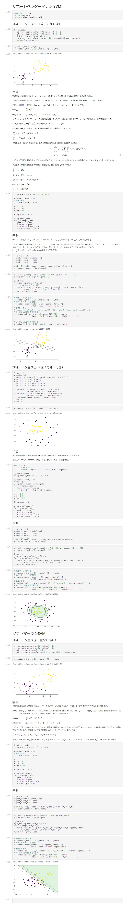

# 機械学習

ラビットチャレンジ

m-takeda | 個人向けコース | 2021-06-12

# １．線形回帰モデル

## １－１．線形回帰モデル

回帰問題を解くための機械学習モデルの一つ

教師あり学習(教師データから学習)

入力とm次元パラメータの線形結合を出力するモデル

※予測値にはハットを付ける（慣例）

## １－２．単回帰モデルと重回帰モデル

単回帰モデル：説明変数が1次元の場合(m=1)であり、幾何学的意味は直線（回帰直線）で仮定する

重回帰モデル：説明変数が多次元の場合(m&gt;1)であり、幾何学的意味は曲面（回帰曲面）で仮定する

## １－３．データの分割

モデルの汎化性能(未知のデータでの制度)を測定するため、学習に使ったデータと別のデータで検証する

学習用データ：機械学習モデルの学習に利用するデータ

検証用データ：学習済みモデルの精度を検証するためのデータ

## １－４．学習

線形回帰モデルのパラメータは最小二乗法で推定する

学習データの平均二乗誤差を最小とするパラメータを探索する（学習データの平均二乗誤差の勾配が0になる点を求める）

※最尤法による推定も可能（回帰の場合には解は最小二乗法と一致する）

## １－５．ハンズオン

# ２．非線形回帰モデル

## ２－１．非線形回帰モデル

複雑な非線形構造を内在する現象に対して、非線形回帰モデリングを実施

基底関数とパラメータの線型結合を回帰関数として使用する

パラメータの推定は、線形回帰モデルと同様に最小2乗法や最尤法による

よく使われる基底関数：多項式関数、ガウス型基底関数、スプライン関数

## ２－２．未学習と過学習

未学習：学習データに対して、十分小さな誤差が得られないモデル

過学習：学習データに対して、小さな誤差は得られたけど、テスト集合誤差との差が大きいモデル

## ２－３．正則化法

モデルの複雑さに伴って、その値が大きくなる正則化項を付けることによって、過学習を抑止する

Ridge推定量（縮小推定）：L2ノルムを利用、パラメータを0に近づけるよう推定する

Lasso推定量（スパース推定）：L1ノルムを利用、いくつかのパラメータを正確に0に推定する

正則化パラータを小さくする→制約面が大きくなる

正則化パラータを大きくする→制約面が小さくなる

## ２－４．モデル選択

学習誤差ではなく汎化誤差が小さいものが良い性能を持ったモデルとなる

適切なモデル(汎化性能が高いモデル)を交差検証法で決定する

交差検証法：データを複数個に分割して、そのうち１つをテスト用として、複数回（イテレータ）行う。イテレータごとに異なるテスト用データセットを用いる。

ホールドアウト法：有限のデータを学習用とテスト用の2つに分割して検証する。手元にデータが大量にある場合を除いて、良い性能評価を与えないという欠点がある

## ２－５．ハンズオン

# ３．ロジスティクス回帰モデル

## ３－１．ロジスティクス回帰モデル

分類問題（クラス分類）を解くための機械学習モデルの一つ

教師あり学習(教師データから学習)

入力はm次元のベクトルとなり、出力は０か１の値となる

## ３－２．シグモイド関数

入力は実数、出力は必ず0~1の値となる

シグモイド関数のパラメータが変わるとx=0付近での曲線の勾配が変わる（極めて大きくすると、単位ステップ関数となる）

シグモイド関数の微分は、シグモイド関数自身で表現することが可能

## ３－３．最尤推定

ロジスティック回帰モデルではベルヌーイ分布を利用する

尤度関数：データは固定し、パラメータを変化させる

尤度関数を最大とするパラメータを探す(推定)

## ３－4．勾配降下法

反復学習によりパラメータを逐次的に更新する

データが巨大になった時にデータをオンメモリに載せる容量が足りない、計算時間が莫大になるなどの問題がある

## ３－５．確率的勾配降下法

データを一つずつランダムに(「確率的」に)選んでパラメータを更新する

データの一部を使用することで計算がより早く終わるので、効率よく最適な解を探索できる

## ３－６．モデルの評価

正解率：正解した数/予測対象となった全データ数（分類クラスに偏りがあると意味をなさない）

再現率：「本当にPositiveなもの」の中からPositiveと予測できる割合（正解事例を漏らさない割合）

適合率：「Positiveと予測」したものの中で本当にPositiveである割合（正解判定の正確さの割合）

F値：適合率と再現率の調和平均（高いほど適合率と再現率が共に高くなる）

## ３－７．ハンズオン

# ４．主成分分析

## ４－１．主成分分析

多変量データの持つ構造をより少数個の指標に圧縮する（情報量はなるべく減らさない）

線形変換後の変数の分散（情報量）が最大となる射影軸を探索する

元のデータの分散共分散行列の固有値と固有ベクトルを求める

固有値の大きな順に第一主成分、第二主成分・・・と呼ぶ

寄与率で評価する

## ４－２．ハンズオン

# ５．アルゴリズム

## ５－１．近傍法(kNN)

分類問題のための機械学習手法

教師あり学習(教師データから学習)

最近傍のデータをk個取ってきて、それらがもっとも多く所属するクラスに識別する

k（チューニングパラメータ）を大きくすると決定境界は滑らかになる

## ５－２．k-平均法(k-means)

教師なし学習

与えられたデータをk個のクラスタに分類するクラスタリング（特徴の似ているもの同士をグループ化）する

初期値の与え方でうまくいかない場合もある

## ５－３．ハンズオン

# ６．サポートベクターマシーン(SVM)

## ６－１．サポートベクターマシーン

２クラス分類のための機械学習手法

線形モデルの正負で2値分類

マージンが最大となる線形判別関数を求める

ソフトマージンSVM：誤差を許容し、誤差に対してペナルティ（スラック変数）を与え最小化を行う

非線形分離：特徴空間に写像し、その空間で線形に分離する

カーネルトリック：高次元ベクトルの内積をスカラー関数（カーネル関数）で表現する

## ６－２．ハンズオン

